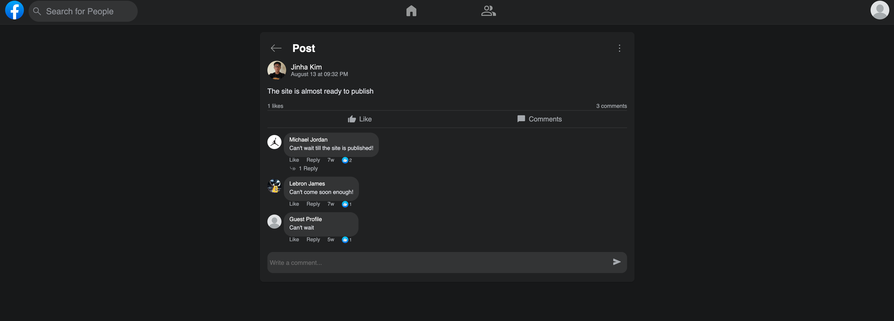
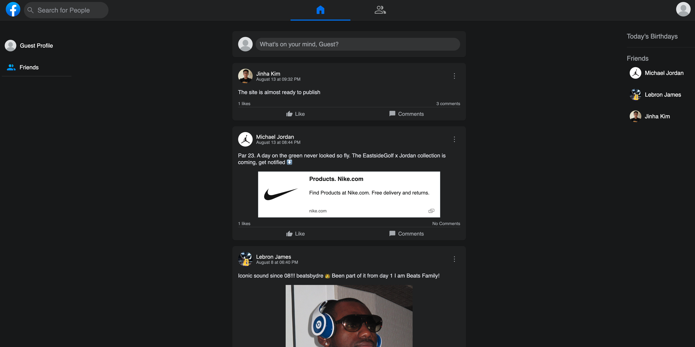
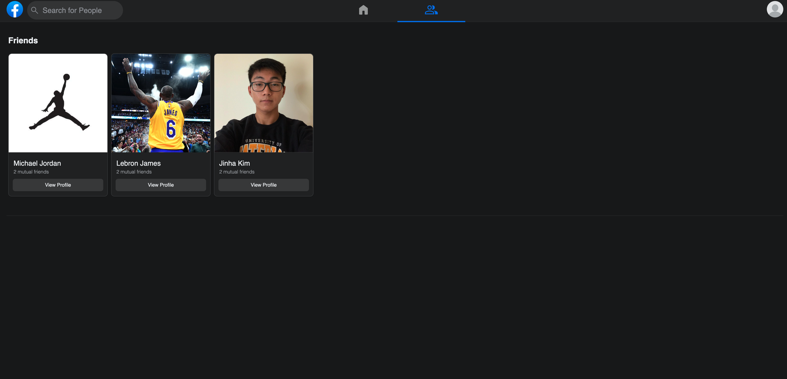

# Fakebook App

A social media app that allows you to connect with your friends!

This app can be run locally or accessed by this link!

## Features

Users:

- Can create, update, and delete your account
- Can create posts
- Can send friend requests to other users
- Can accept friend requests from other users
- Can login with existing Facebook credentials

Other:

- Users are suggested recommended friends
- Posts are displayed from other friends in the home feed
- Users remain logged in with a token
- Utilizes [PassportJS](https://www.passportjs.org/) for password authentication
- Utilizes [BcryptJS](https://www.npmjs.com/package/bcrypt) for password encryption
- Utilizes [MongooseJS](https://mongoosejs.com/docs/) to store and access data

## 📸 Screenshots

## 🔗 Links

## License

[MIT](https://choosealicense.com/licenses/mit/)
